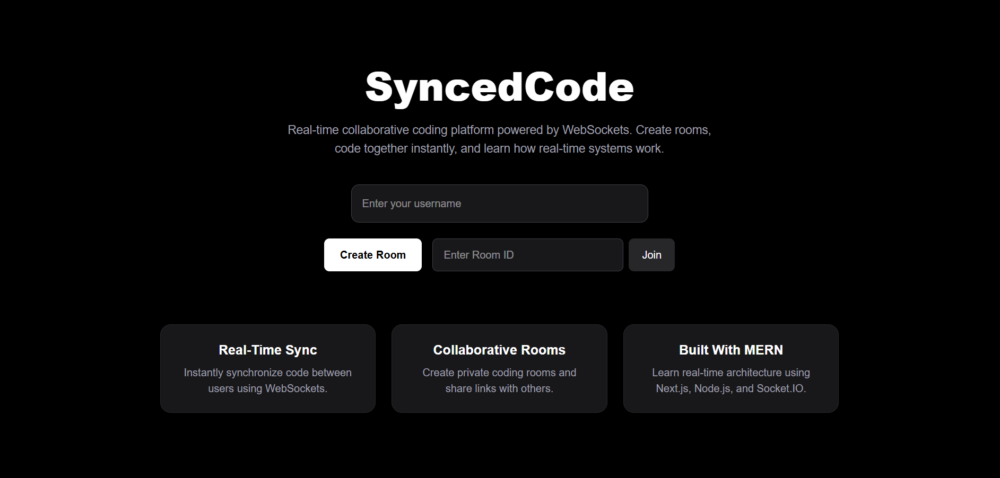

# 🚀 SyncedCode

<p align="center">
  Real-time collaborative coding workspace built with MERN, WebSockets, Monaco Editor, and Next.js.
</p>

---

# ✨ Features

✅ Real-time collaborative code editing  
✅ Live user presence system  
✅ Live cursor tracking  
✅ Rich collaborative notes editor  
✅ Monaco Editor integration  
✅ Room-based collaboration  
✅ Username system with live updates  
✅ Beautiful modern SaaS UI  
✅ Theme switching  
✅ Multi-language support  
✅ WebSocket-powered realtime sync  

---

# 🖥️ Preview

## Home Page



---

## Collaborative Workspace


---

## Live Users + Cursor Tracking

---

# 🛠️ Tech Stack

## Frontend
- Next.js
- React
- Tailwind CSS
- Monaco Editor
- TipTap Editor
- Framer Motion
- Socket.IO Client

## Backend
- Node.js
- Express.js
- Socket.IO

---

# ⚡ Real-Time Architecture

```txt
Frontend (Next.js)
        ↓
Socket.IO Client
        ↓
Express + Socket.IO Server
        ↓
Realtime Room Synchronization
```

---

# 🔥 Implemented Real-Time Features

## 💻 Live Code Collaboration
Users can collaboratively edit code in realtime using WebSockets.

---

## 📝 SyncedNotes
Rich collaborative notes editor with:
- Bold
- Italic
- Headings
- Live synchronization

---

## 👥 Live Presence System
See:
- Active users
- Who is online
- Real-time collaboration activity

---

## 🎯 Cursor Tracking
Track where collaborators are editing in realtime.

Example:
```txt
Ankit editing line 25
Rahul editing line 42
```

---

# 📂 Project Structure

```bash
syncedcode/
│
├── client/
│   ├── app/
│   ├── components/
│   ├── socket/
│   └── public/
│
├── server/
│   ├── server.js
│   └── package.json
│
└── README.md
```

---

# ⚙️ Environment Variables

## Frontend

Create:

```bash
client/.env.local
```

Add:

```env
NEXT_PUBLIC_SOCKET_URL=http://localhost:5000
```

---

## Backend

Create:

```bash
server/.env
```

Add:

```env
PORT=5000
```

---

# 🚀 Installation

## 1️⃣ Clone Repository

```bash
git clone https://github.com/your-username/syncedcode.git
```

---

## 2️⃣ Install Frontend

```bash
cd client
npm install
```

---

## 3️⃣ Install Backend

```bash
cd ../server
npm install
```

---

# ▶️ Run Locally

## Start Backend

```bash
cd server
npm run dev
```

---

## Start Frontend

```bash
cd client
npm run dev
```

---

# 🌐 Deployment

## Frontend
Deploy on:
- Vercel

## Backend
Deploy on:
- Render
- Railway

---

# 🧠 What I Learned

This project helped me understand:

- WebSockets
- Real-time communication
- Collaborative systems
- Socket.IO rooms
- Presence systems
- Cursor synchronization
- Rich text synchronization
- Modern frontend architecture
- MERN deployment workflows

---

# 📌 Future Improvements

- Live collaborative cursors inside editor
- CRDT-based synchronization
- Authentication (Google/GitHub)
- Persistent MongoDB storage
- Video/audio collaboration
- Code execution engine
- File explorer system
- Collaborative terminal

---

# ❤️ Made With Love

Built with ❤️ by **Ankit Mathapati**
